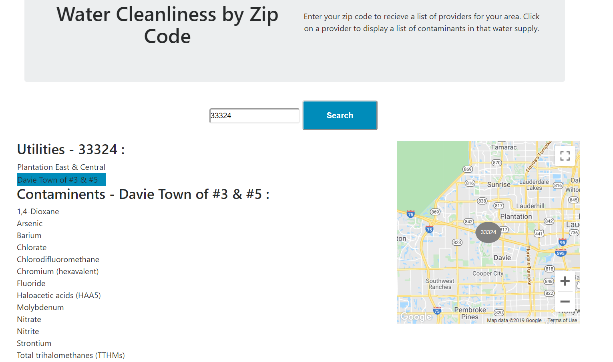

## Group 9B
Link to deployed site- unavailable
Please note the main branch was set up to run for Heroku, but it is not to be deployed onto Heroku. Access if the UI_SF branch if you want to run it locally. A Google api key is needed, it requires both Google Maps and Geocoding, please put it into the config.example file.
To run locally, go to the root, then run npm install, then npm start. 

API's used-
Google-
Google maps, 
Geocoding

## Code used as a template
https://github.com/google-map-react/google-map-react

